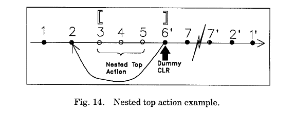

**9.NESTED TOP ACTIONS内嵌顶级动作**  
有时候，我们希望某个事务的一些操作可以提交，不管该事务最后有没有提交。我们同样需要这些更新操作的原子性。This is illustrated in the context of file extension.某事务扩展了该文件，这导致修改了数据库的一些系统数据，其他事务需要用到这个扩展域的指针来。如果这个扩展事务回滚了，那么对于这个扩展的影响不能undo.这种undo可能会导致其他一些已提交的事务的操作丢失。在另一方面，如果对系统数据扩展相关的更新，在他们完成之前因为系统崩溃而终止了，那么就需要undo他们。这种类型的操作通常有独立的事务执行，并被称之为top action【51】。一个事务若启动了这样的一个独立事务，它会等到该独立事务完成提交后才继续执行。这个独立事务的机制是，初始化事务和独立事务直接的锁冲突是很容易发生的，这是不可接受的。  

在ARIES中，使用“内嵌顶级动作”这一概念，我们可以高效的支持这种需求，而不需要开启单独的事务来完成。执行一个内嵌顶级动作，意味着如果该操作完成了就不能再undo,接着基于此内嵌顶级动作的后续操作会记录到持久化存储中，不管外部的事务是否关闭。  

一个事务执行定义这样一个内嵌顶级动作序列，包括下面的步骤：  
（1）确定当前事务最新日志记录的位置。  
（2）记录该内嵌顶级动作相关的redo和undo信息；然后  
（3）在完成之后，写dummy CLR,其中的UndoNxtLSN指针指向步骤1中记录的日志位置。  
我们假设，这些动作（比如创建文件，以及它们对系统数据的关联更新，通常在数据库系统之外）的影响是客观的，在写dummy CLR之前。当我们讨论redo的时候，我们通常是只那些处于数据库内部的系统数据。  

  
使用内嵌顶级操作的方案，如果操作完成后，外部事物回滚了，那么通过dummy CLR就能确保对于内嵌顶级操作的更新不会被undo.如果系统在写dummy CLR之前崩溃了，那么这个未完成的内嵌顶级动作就会被undo,因为对该动作记录的undo-redo（对应于redo-only）日志。这为该操作提供了原子性。和普通的CLR不同，在redo遍历的时候遇到dummy CLR不会做任何redo操作。dummy CLR可以当成是一种内嵌顶级动作的提交记录。这种方案的优势在与外层的事务并不需要等待这条记录写到持久化存储之后再继续执行。同样，我们不需要承担启动另新事务的成本。我们也不会遇到锁冲突的问题。与该方法相对应的就是特耗时的独立事务的方案。 
 
图14给出了一种内嵌顶级操作的例子，该操作包含动作3,4,5.日志6'表示dummy CLR。即使，外部事务被中断了，然后需要回滚，6'就保证了该内嵌顶级动作不会undo.  
 
需要强调的是，内嵌顶级操作依赖历史重演。如果该操作只包含一个更新操作，那么我们可以使用单条的redo-only 日志来记录，从而避免写dummy CLR.【59,62】中可以找到关于在基于hash的存储引擎和索引管理中使用内嵌顶级操作的应用。  