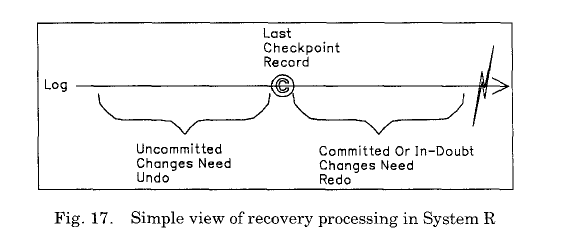
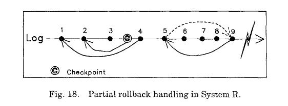

**10. RECOVERY PARADIGMS恢复模型**  
本节将会讨论一些问题关于：提供低颗粒度（比如记录级）锁，处理事务回滚。一些其他的讨论参见【97】。我们的目标是指出一些现有的恢复方案的某些特性会导致很难完成我们的目标，从而引出我们得包含在ARIES中的一些特性。尤其，我们会指出基于影子页技术的SystemR的一些恢复模型，并不适用于使用WAL协议以及高并发需求。在之前，几个System R的恢复模型改进成适用WAL协议，这会导致算法设计上的限制和错误【3, 15, 16, 52, 71, 72, 78, 82, 88】。对于System R 模型，关注以下几个方面：

- 在重启恢复时进行选择性redo.  
- 恢复时，undo先于redo之前处理。  
- 在事务回滚时不写更新日志（比如：没有CLR）。  
- 索引和表空间的变更不记录日志。  
- 对页自身涉及到日志变更不跟踪其页状态。 
-  
**- 10.1 Selective Redo 选择性redo**  
本小节的目标是介绍选择性redo的概念，它应用在很多系统中。并指出它在支持低颗粒度锁和基于WAL协议恢复方面的问题。其目标是引出为什么ARIES使用历史重演。  

当事务系统从崩溃中恢复是，他们通常执行两次日志遍历来执行数据库恢复：一次redo遍历，一次undo遍历（参见图6）。System R首先执行undo遍历，然后执行redo遍历。我们之后会指出，SystemR 的undo先于redo的模型使用WAL和低颗粒度锁是会出错的。另一方面，基于WAL的DB2采用了相反的顺序。在Redo遍历时，System R只redo已提交的和prepared（in-doubt）事务【31】的动作。我们称之为选择性redo。直观上来看，System R的选择redo模型似乎很高效，但它有很多陷阱，我们下面会一一讨论。  

一些基于WAL的系统，比如DB2，只支持页锁和选择redo【15】。如果使用了记录锁，那么这种方案会导致数据不一致性。我们考虑一下，之前描述的WAL技术（每个页中包含一个LSN）。在redo遍历时，页上的LSN会和日志中的LSN相比较，来决定该日志记录是需要重新更新到该页上。如果页LSN小于日志的LSN，那么需要redo这个更新，然后，页LSN设置为日志的LSN（参见图15）。在Undo遍历时，如果页LSN小于待undo日志的LSN，那么不需要对页上进行undo。否则就需要undo。当事务回滚时，不管需不需要对该页上执行undo,描述该更新的CLR需要作为undo操作的一部分写出来。如果写了CLR，即使该页不会执行此更新，这使得介质恢复更为简单，并且不需要用一种特殊的方法来处理回滚。处理系统重启恢复时的失败，也需要这种特性：某页上并没有真正执行undo，但也会写CLR。
  
  

这有可能会发生，如果有个对于页P1的更新U2不需要undo，但是有一个对于页P1较早的更新U1需要undo，结果写了U1'(U1的CLR），并且P1的LSN也变更成U1'的LSN(>U2的LSN)。在那之后，如果在系统崩溃并中断了这个重启恢复之前，P1已经写入到持久化存储中，那么在下一次恢复的时候，它就会认为P1包含了对U2的更新，并且尝试undo它。在另一方面，如果写了U2'，就不会有这样的问题。需要强调的是，即使只是用了页锁，这种问题还是会有，比如DB2中这种情况【15】。  

考虑到选择性redo基于WAL的方法的这些特性，我们会丢失对页（对应于失效（正在执行或正在回滚）事务）状态的跟踪信息，这些页被失效事务首先修改过（比如，T2的更新操作LSN 20），接着被一个非失效事务修改了（比如，T1的更新操作LSN 30），这个操作需要redo。后者会使得页的LSN大于失效事务的值。所以在undo失效事务时，我们就不知道该更新是否需要undo了。图15,16描绘这个问题。在后一个场景中，不会redo LSN 20的更新，因为它属于失效事务，但是会redo LSN 30的更新，因为它属于非失效事务，这便导致了undo遍历来undo之前的一次更新，尽管它并没有在该页上更新过。这是因为undo逻辑依赖于page_LSN值来决定该操作是否需要undo（如果page_LSN大于或等于日志的LSN就undo）。因为没有历史重演，page_LSN就不能作为该页的当前真实状态的指示。 
 
只有下列一些情况下，对于一个未在该页上更新过的动作执行undo是无害：比如，在物理/面向字节的锁和日志是，IMS [76], VAX DBMS and VAX Rdb/VMS [81], and other systems [6]是如此实现的，他们没有对空闲空间重用，对于所有记录都有唯一的key。在操作日志时，对于不在该页上的更新undo其原始操作，会导致数据不一致性。  

  
调换选择redo和undo遍历的顺序同样也没法解决此问题。【3】中提出的是一种错误的方案。如果undo遍历先于redo遍历，那么我们就会丢失对那些需要redo动作的跟踪。在图15中，20的undo使得页LSN大于30，因为，CLR的输出，是的该CLR的LSN设置为该页的CLR。由于在redo遍历期间，只有当页LSN小于日志的LSN时，该日志才会redo，我们不能redo30，即使之前对该页没有做更新。不做redo会影响事务的持久性和原子性。  

System R 使用的影子页技术并不需要page_LSN来决定哪些需要undo，哪些需要redo。通过影子页技术，在checkpoint的时候，一种包含该数据库的连续版本的操作称为影子版本，保存在持久化存储中。两个checkpoint创建了一个新的更新页版本，继而构建了数据库的当前版本（参见图1）。在重启时，从影子版本开始恢复，并且在恢复过程中执行影子操作。因此，哪些更新以及在数据库中，哪些不在，毫不含糊。在最后一次checkpoint之后的所有更新日志都不在数据库中，在这之前的都在数据库中。这就是为什么System R使用选择redo也能正确恢复的原因。还有些其他原因：虽然索引和空间变更不记录日志，但是它们会逻辑redo或逻辑undo。  

正如之前所说，ARIES并不使用选择redo，而是使用历史重演。除了可以支持低颗粒度锁，历史重演还有其他优势。它可以使我们提交事务中的一些操作，不管这个事务最后有没有提交，第9节有详细描述。  

**10.2 Rollback State回滚状态**  
本节的目标是讨论回滚中跟踪其步骤的难点以及如何使用CLR来描述回滚中的更新操作，继而解决一些问题。虽然CLR已经应用到很多系统中，也存在了很长时间，但是还没有哪篇文章着重讨论过CLR：使用它们的问题与优势。它们在数据库恢复中所扮演的角色仍没得到研究社区的关注。undo操作是否需要undo以及一些其他的问题会在【56】做为开放问题。在本节中，以及在本文的其他地方，在合适的上下文中，我们会提到CLR所有已知的优势。在13节会总结CLR的这些优点。 
 
事务可能会因为很多原因进行全部或部分回滚。比如：违反唯一性约束只会导致违规的这条操作回滚而不影响整个事务。图3描绘了一种部分回退。对于部分回退的支持【1,31】，至少在内部支持，如果不是在应用层支持，对于当今的现有的事务系统也是一个很重要的需求。当系统崩溃时，某个事务正在回滚，并且回滚的一些操作已经写到持久化存储上，因此，我们需要使用一种方式来跟踪事务回滚的状态。这对System R系统相对比较简单。在System R中我们唯一需要关心事务状态的时刻是在执行checkpoint的时候。所以System R中的checkpoint记录了每个活动事务的下一个待undo的记录，一些事务可能正在回滚。在系统崩溃时，事务的回滚状态并不重要，因为在重启时，从最近一次checkpoint开始的数据库变更并'不可见'。也就是说，重启恢复是从系统崩溃前的最后一次checkpoint开始---这个是系统崩溃时的影子版本。除此之外，因为没有写CLR，System R需要执行一些特殊流程来处理那些已经提交的或在in-doubt态的事务，这些事务在最近一次checkpoint之后初始化的或者完成了部分回退的。这种特殊处理是为了避免在redo遍历的时候对日志进行多次遍历。设计者们通过向后扫描来避免一种情况：redo一些操作，不久之后又undo这些操作，比如部分回退操作。 

  
  
图18展示了System R的一种恢复场景。所有日志都由一个叫T1的事务输出。在checkpoint记录中，T1指向的记录2，因为在执行checkpoint的时候，记录3已经因为部分回滚而undo了。System R不仅不写CLR，也不会写顺序日志记录来标识已经发生了部分回滚。这种信息需要从该事务日志记录链的裂口处推断出来。通常，事务写一条日志记录并通过PrevLSN指针指向最近一条日志记录。但是，在部分回滚后写的第一条日志记录并不遵循此规则。当我们在分析遍历检测时，记录4的Prev_LSN是指向记录1的，而不是指向记录3的，然后我们就能知道，部分回顾从3开始到2结束。因此在恢复时，需要恢复的数据库状态是最后一次checkpoint的数据库状态，记录2肯定是要undo的。对于1是否需要undo是取决于T1是否是失效事务。  

在分析遍历时，它得出记录9指向记录5，因此可以推断出有一个部分回滚导致了记录6,7,8的undo。为了确保这些回滚的记录不会在redo遍历时被redo，该日志会在分析遍历时打上补丁，将记录5的前置指针指向记录9。  

如果记录9是一个提交记录，那么在undo遍历的时候，记录2就会被undo，并且在redo遍历时，记录4,5会被redo。因此在undo遍历和redo遍历中会涉及相同的事务。接来看一下，在SystemR中为何undo遍历要在redo遍历之前执行，考虑到下面的场景：若某个删除了一条记录，该记录的ID可以被重用，并被相同的事务用来插入新记录。在这一的情况下，一条记录可能会在部分回滚时被删掉，这会在undo遍历中处理。然后该记录ID可能会在事务的其他地方被重用，这会在redo遍历中处理。为了针对系统崩溃前的原始操作顺序进行历史重演，那么undo必须在redo之前执行。  

如果9不是‘提交’或者‘准备’记录，那么该事务就认为是个失效事务，在undo遍历的时候，记录2,1都会被undo。在redo遍历的时候，就没有记录需要redo了。  

由于System R不会写CLR ,一个事务的undo操作被其他事务的正常流程或者undo流程所打散了，所以具体的undo方式就不知道了。在恢复时对于页的处理会和正常流程有很大不同（比如：历史重演也无法保证）。System R中没有索引变更日志记录也造就了这一点（参见脚注8）。这可能会导致一些空间分配上的问题，比如在正常流程的时候没有分裂，但是在重启时，redo或undo过程中会触发分裂（参见5.4节）。不生成CLR同样会阻止redo的日志信息被物理执行（比如：对于某个对象的操作会被日志记录--而不是记录这个操作之后的镜像）。考虑如下的一个例子：在最近一次checkpoint之后有块数据值为0。然后事务T1加1，T2加2，T1回滚，T2提交。如果T1，T2都记录数据镜像来redo以及其操作来undo。那么就会导致数据不一致问题，因为在恢复后，该值为3而不是2。在这种情况下，System R对事务T1的undo是通过不redo它的操作来完成的。当然，System R并不支持高级锁模型，来使得2个事务可以同时修改相同的对象。使用逻辑dumb从而允许redo物理信息，可以高效的执行redo恢复。这并不意味着面向字节的日志需要依赖是否使用了弹性存储管理（参见10.3节）。记录逻辑undo信息就能支持高并发的undo（参见【59,62】）。ARIES都支持这些。  

WAL系统是通过在回滚时使用CLR来解决这一问题。所以当恢复是，数据的状态通常是“marching”前进的，即使一些原始操作以及被回滚了。【52】中提出的一个不同的方案，被LSN标识的数据将会在回滚时被“pushed”回去。这种方案只能在页级（或更粗颗粒度）锁下工作。输出CLR的最直接的后果是，如果事务要回滚了，那么一些原始操作会被重复undo，更糟的是，补偿动作也会重复undo。如图4所描绘的：事务在系统崩溃前开始回滚。那么在恢复时，之前写的CLR被undo了，已经被undo的non-CLR又被undo了一遍。ARIES会避免这种情况，当然仍然会输出CLR。不undo CLR有利于死锁管理，并且可以早点释放待undo对象上的锁（参加22项，12节和6.4节）。CLR的其他优点会在下一节和【69】中讨论。有一些我们已经在第8节中讨论了。  

不幸的是，像【92】中提到的恢复方法并不支持部分回滚。我们认为这是这类方法的一大缺陷。 
 
**10.3 Space Management空间管理**  
本小节的目标是指出空间管理中一些问题：当使用比页级低颗粒度锁时，以及如果高效的支持变长数据存储。  

使用弹性存储来执行纪录锁时需要处理的一个问题是：需要确保一个事务在对某个数据进行删除或更新时造成的空间释放，在该事务提交前不会被其他事务使用。该问题在【76】中有详细讨论。在此我们并不讨论空间预留问题。对此感兴趣的读者可以参考【50】。对于索引更新，特别是并发增加，我们并不希望一个事务提交之前，其他事务都没法使用。在这种情况下，undo是使用逻辑undo的处理方式，在【62】中有详细描述。  

由于弹性存储管理是其目标，若使用物理（比如面向字节的）锁并且将数据都记录在一个页中，正如一些系统所做的（参见【6,76,81】），这是不能接受的。也就是说我们不想使用记录的第一个字节作为该记录的锁名字。我们也不希望用一些特殊字节来标识待修改的页。日志和锁必须在页中合理执行。记录锁的名字会使用一些类似（page#,slot#），slot#标识该页的位置，这会指向记录的真实位置。日志记录描述了该数据记录是如何变更的。结果就是垃圾回收器会搜集该页上未使用的空间，并且在页中移动数据时，不需要加锁或者记录日志。这使得我们可以高效的移动变长数据记录，可以在页中随意移动记录。在类似IMS系统中，需要经常运行工具来处理存储碎片。这对用户来说，降低了数据可用性。  

图19展示了一种场景：无需跟踪特定表的状态（比如，在持久化存储的页中存储LSN），并且尝试从日志的一个较早的时刻执行redo直到有问题的地方，这里使用了弹性存储管理。假设，图19中的更新都是对于同一个页，同一个事物，它像插入一个200字节的数据到该页上，但是只有100字节的剩余空间。这显示了需要对页状态的准确跟踪，并使用LSN来避免尝试redo已经执行到该页上的操作。
  
通常，每个文件会包含一些有关系的记录，使用少量的页，这些页被称之为空闲空间目录页（FSIP）。在DB2中称之为SMP。每个FSIP描述了很多数据或索引页的空间信息。在插入记录的时候，通常会基于从聚集索引获取的信息，聚集索引记录了相同key（或者相近有关key）的不同记录的位置,对于插入新记录，会向一个或多个FSIP请求空闲空间。FSIP只有一个模糊信息（比如：至少该页的25%是满的，至少50%是满的等等。）。这样就能确保不是每次空间释放或者申请都会导致该页的信息修改。为了避免在redo和undo对FSIP恢复做特殊处理，并且提供恢复独立性，对于FSIP的更新也必须记录日志。  

事务T1可能会导致数据也从23%满到27%满，因此就会更新FSIP从0%满到25%满。接着T2可能导致空间变为35%慢，这并不需要更新FSIP。现在如果T1回滚了，那么空间变为31%满，同样不会更新FSIP。如果T1将FSIP的变更日志作为redo/undo记录，那么T1的回滚就会导致FSIP变为0%满，考虑到当前数据页的实际情况，这就不正确了。该场景表明了对于FSIP的变更只能记录redo-only日志，并且对空闲空间目录的变更只能做逻辑undo。也就是说，在做数据页更新的时候，系统要判断该操作是否会影响空闲页信息的变更，如果确实影响了，那么就需要更新FSIP，并且输出描述该变更的CLR。我们很容易构造一个例子：事务在正常流程时对FSIP不更新，但是在回滚的时候需要对其更新。我们同样可以构造一个例子：在正常流程中的更新并不是回滚时完全相反的操作。  

**10.4 Multiple LSNs多重LSN**  
如果每个页只有一个LSN会有问题：当我们想支持记录锁是，可能需要跟踪每个对象的状态，这样就要给每个对象分配独立的LSN了。接下来我们会解释这不是一个好方案。  

DB2已经支持低于页级别的锁了。这在索引上会使用，如果用户要求DB2将索引的页节点从2个分割成16个最小页时，就需要对这个最小页加锁【10,12】。DB2对这些页恢复时，在redo遍历时不会redo失效会话的操作，如下面所示。除了对页节点使用LSN，DB2通过每个最小页上的LSN来跟踪其状态。当最小页更新是，相应记录的LSN会存在最小页的LSN域中。页的LSN被设置成这群最小页中的最大LSN值。在undo的时候，是使用迷你页的LSN，而不是页LSN来和日志记录比较，去判断改记录是否需要在该迷你页上undo。这种技术，除了会导致使用更多的空间来存储LSN，也会是的空间碎片化（并且会浪费）来存储Key。更进一步，它并不能很方便的对记录和key加锁，尤其当需要高效的支持变长数据对象时。对删除的对象维护LSN也是最费力的。我们希望每个页只有一个单独的状态变量（LSN），即使对迷你页加锁，然后进行恢复，特别是介质恢复，也能高效执行。在重启恢复时，在失效事务回滚之前，使用ARIES中简单的历史重演技术足够满足需求了。由于DB2将页分割成固定个数的迷你页，不需要特别的考虑空间预留问题。像【61】中建议的支持低颗粒度锁的方案，不支持变长数据存储（那篇论文中使用了atom）