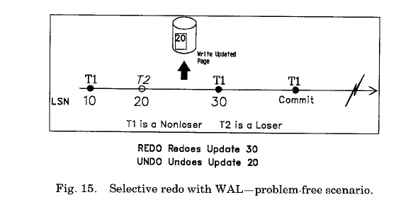

**10. RECOVERY PARADIGMS恢复模型**  
本节将会讨论一些问题关于：提供低颗粒度（比如记录级）锁，处理事务回滚。一些其他的讨论参见【97】。我们的目标是指出一些现有的恢复方案的某些特性会导致很难完成我们的目标，从而引出我们得包含在ARIES中的一些特性。尤其，我们会指出基于影子页技术的SystemR的一些恢复模型，并不适用于使用WAL协议以及高并发需求。在之前，几个System R的恢复模型改进成适用WAL协议，这会导致算法设计上的限制和错误【3, 15, 16, 52, 71, 72, 78, 82, 88】。对于System R 模型，关注以下几个方面：
- 在重启恢复时进行选择性redo.  
- 恢复时，undo先于redo之前处理。  
- 在事务回滚时不写更新日志（比如：没有CLR）。  
- 索引和表空间的变更不记录日志。  
- 对页自身涉及到日志变更不跟踪其页状态。  
**- 10.1 Selective Redo 选择性redo**  
本小节的目标是介绍选择性redo的概念，它应用在很多系统中。并指出它在支持低颗粒度锁和基于WAL协议恢复方面的问题。其目标是引出为什么ARIES使用历史重演。  
当事务系统从崩溃中恢复是，他们通常执行两次日志遍历来执行数据库恢复：一次redo遍历，一次undo遍历（参见图6）。System R首先执行undo遍历，然后执行redo遍历。我们之后会指出，SystemR 的undo先于redo的模型使用WAL和低颗粒度锁是会出错的。另一方面，基于WAL的DB2采用了相反的顺序。在Redo遍历时，System R只redo已提交的和prepared（in-doubt）事务【31】的动作。我们称之为选择性redo。直观上来看，System R的选择redo模型似乎很高效，但它有很多陷阱，我们下面会一一讨论。  
一些基于WAL的系统，比如DB2，只支持页锁和选择redo【15】。如果使用了记录锁，那么这种方案会导致数据不一致性。我们考虑一下，之前描述的WAL技术（每个页中包含一个LSN）。在redo遍历时，页上的LSN会和日志中的LSN相比较，来决定该日志记录是需要重新更新到该页上。如果页LSN小于日志的LSN，那么需要redo这个更新，然后，页LSN设置为日志的LSN（参见图15）。在Undo遍历时，如果页LSN小于待undo日志的LSN，那么不需要对页上进行undo。否则就需要undo。当事务回滚时，不管需不需要对该页上执行undo,描述该更新的CLR需要作为undo操作的一部分写出来。如果写了CLR，即使该页不会执行此更新，这使得介质恢复更为简单，并且不需要用一种特殊的方法来处理回滚。处理系统重启恢复时的失败，也需要这种特性：某页上并没有真正执行undo，但也会写CLR。  
  
这有可能会发生，如果有个对于页P1的更新U2不需要undo，但是有一个对于页P1较早的更新U1需要undo，结果写了U1'(U1的CLR），并且P1的LSN也变更成U1'的LSN(>U2的LSN)。在那之后，如果在系统崩溃并中断了这个重启恢复之前，P1已经写入到持久化存储中，那么在下一次恢复的时候，它就会认为P1包含了对U2的更新，并且尝试undo它。在另一方面，如果写了U2'，就不会有这样的问题。需要强调的是，即使只是用了页锁，这种问题还是会有，比如DB2中这种情况【15】。  
考虑到选择性redo基于WAL的方法的这些特性，我们会丢失对页（对应于失效（正在执行或正在回滚）事务）状态的跟踪信息，这些页被失效事务首先修改过（比如，T2的更新操作LSN 20），接着被一个非失效事务修改了（比如，T1的更新操作LSN 30），这个操作需要redo。后者会使得页的LSN大于失效事务的值。所以在undo失效事务时，我们就不知道该更新是否需要undo了。图15,16描绘这个问题。在后一个场景中，不会redo LSN 20的更新，因为它属于失效事务，但是会redo LSN 30的更新，因为它属于非失效事务，这便导致了undo遍历来undo之前的一次更新，尽管它并没有在该页上更新过。这是因为undo逻辑依赖于page_LSN值来决定该操作是否需要undo（如果page_LSN大于或等于日志的LSN就undo）。因为没有历史重演，page_LSN就不能作为该页的当前真实状态的指示。  
只有下列一些情况下，对于一个未在该页上更新过的动作执行undo是无害：比如，在物理/面向字节的锁和日志是，IMS [76], VAX DBMS and VAX Rdb/VMS [81], and other systems [6]是如此实现的，他们没有对空闲空间重用，对于所有记录都有唯一的key。在操作日志时，对于不在该页上的更新undo其原始操作，会导致数据不一致性。  
  

