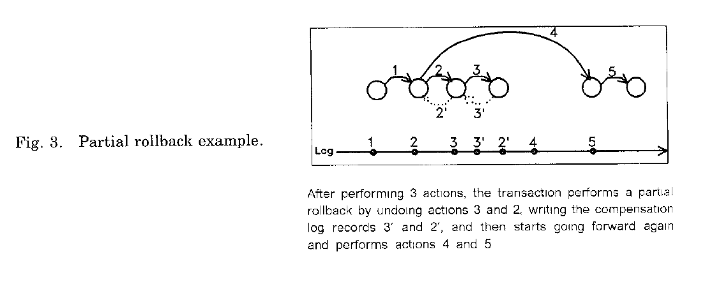
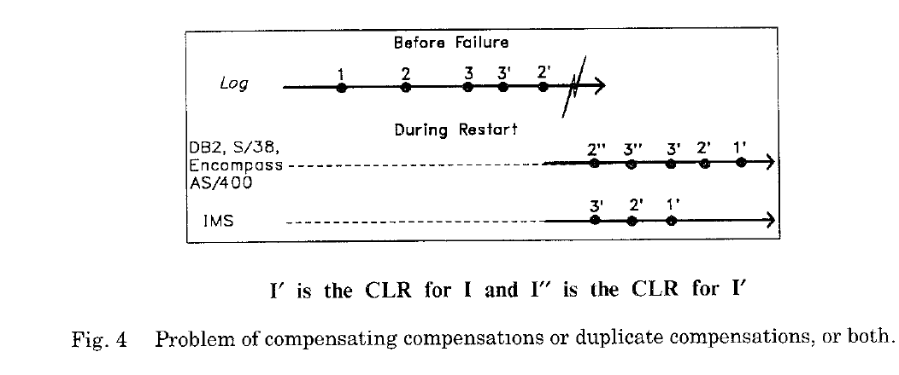
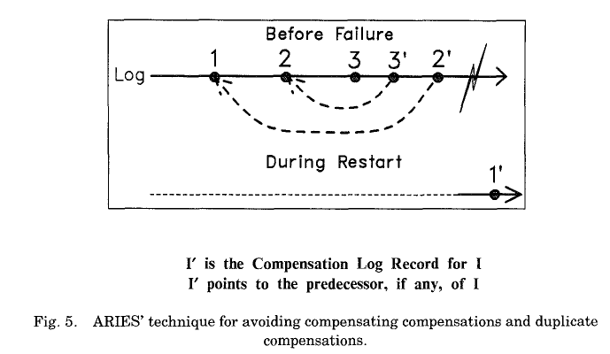
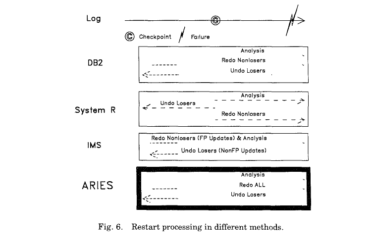

3 OVERVIEW OF ARIES

本章节的主要是对Aries协议的概述，它恰如其分的满足了我们在第二节设定的那些目标。像延迟恢复，选择恢复，重启恢复时的并发模型，等等，将会在该论文的其他章节进行讨论。

在（进程，事务，系统，介质）发生奔溃情况下，ARIES保证了事务的原子性和持久性。为此，ARIES通过使用日志先行（WAL）的方式来跟踪对数据库所做的变更操作。除了记录日志，以一个影响页为基准，在事务执行更新的时候，ARIES同样也会记录（通常使用补偿日志记录CLRs[compensation log records]）事务的部分或者全部回滚的操作。图3给出了一种部分回滚的例子，该事务先执行了3次操作，然后回滚了2个，接着继续执行。由于有两个变更的undo,会写两个CLRs。在ARIES中，CLRs都是redo-only日志记录。通过合理的将CLRs和日志记录串连起来，就能确定一个有限的日志记录，甚至在重启或者嵌套回滚时重复失效也能如此。与之相反的就是IMS,它可能会执行多次相同的non-CLR，在AS/400, DB2 and NonStop SQL中，除了会多次执行相同的non-CLR，也会undo CLR一次或多次（参考图4）。这已经导致了现实中客户系统的一系列问题。

在ARIES中，如图5所示，当一条日志记录的undo触发了一个CLR的写入，该CLR除了包含这个对redo操作的补偿信息外，它同样会包含一个UndoNxtLSN来指向这个条回滚日志的前置记录。由于每条日志（包括CLR）包含了PrevLSN指针，指向同一事务的先前的最近的一条日志，因此，该前置信息是完全可用的。通过UndoNxtLSN指针，我们可以精确判断出该事务中还有多少操作没有undo。在图5中，日志3'（日志3的CLR）,指向日志2（日志3的前置日志）。从而在回滚的时候，最新写入的CLR中的UndoNxtLSN字段标识了其回滚的进度。当由于系统奔溃而中断了回滚操作或者是在执行嵌套回滚的时候，通过UndoNxtLSN字段，就可以知道从什么地方继续该事务的回滚操作。这使得系统可以跳过那些已经做过的回退操作。根据影响的页和原始操作的逆向操作，CLR可以描述在undo时，哪些操作确实执行了，哪些操作并不需要执行。也就是说，可以支持高并发的逻辑回退了。例如：

一个事务在B+树的页10插入了一个key，在这个插入提交前，另一个事务可能会将其（key）移动到页20上。之后，如果第一个事务想回滚，它会重新遍历该树并定位到页20上的key，然后删掉它。这时将会写入一条CLR来描述页20上的删除key操作。这使得面向页的redo将变得十分高效。[59, 62]描述了 ARIES/LHS and ARIES/IM 如何实现这种逻辑回退的功能。

ARIES使用每个页上的LSN来跟踪该页的状态。每当某个页被更新或者写入一条日志记录时，这个日志记录的LSN就会被记录到该页的page_LSN域中。在重启恢复和介质恢复的时候，页上的LSN标识使的ARIES可以精确跟踪这个页关于其上的日志更新的状态。这使得ARIES可以使用一些新奇锁模型，通过它们，在一个事务提交了它对一条记录的更新操作之前，另一个事务同样可以对相同数据做一些操作。

在正常运行时，ARIES定期的执行检测点。检测点的日志记录定义了，那些活动的事务，它们的状态，它们最新写入日志记录的LSN，以及仍在缓存池中的被修改的数据（脏数据）。最后一个信息需要用来决定重启恢复从什么地方开始redo。

在重启恢复时（参见图6），ARIES首先从上次检查点的第一条记录扫描日志知道日志结束。在分析遍历的时候，从检测点截止到这条日志结束期间的脏页和仍在执行的事务会被提取出来。分析流程使用脏页信息来判断接下来的redo日志扫描流程的起始点（RedoLSN），分析流程同样确定了在undo流程时哪些事务需要回滚。对于每个真正执行的事务，最新写入的日志记录的LSN同样可以确定。接着，在redo流程时，有些日志操作已经记录到物理存储上，并影响了数据库中的页，但在系统奔溃前没有写入到非易失存储中，ARIES对这些日志进行*历史重演*。所有事务的都是这么做的，包括那些在系统奔溃时既没提交的也没进入到2段式提交的in-doubt态的事务（即使那些所谓的丢失事务也会重做）。本质上就是将数据库状态恢复到系统奔溃的那一刻。如果受影响的页的page_LSN小于日志记录的LSN，那么这条日志记录就会重做。重做的时候不会记录日志。重做遍历会占有锁来保证那些分布式事务中未提交的变更在重启恢复结束的时候任然处于in-doubt(prepared)状态。

接下来的日志遍历就是undo遍历，所有丢失的事务都会以一种逆序的方式，in a single sweep of the log，来回滚。对于每一个未完全回退的丢失的事务，不断的获取器下一条日志记录的最大LSN，直到没有事务需要回退。和redo遍历不同，在undo遍历（和在正常undo）的时候,undo的执行并不是一个条件操作。也就是说，ARIES并不会比较受影响页的page_LSN和日志记录的LSN来决定是否需要undo这个操作。当一个non-CLR在undo遍历的时候遇到一个事务，如果它是一条undo-redo或者undo-only日志，那么该条操作就要被回退。无论如何，

