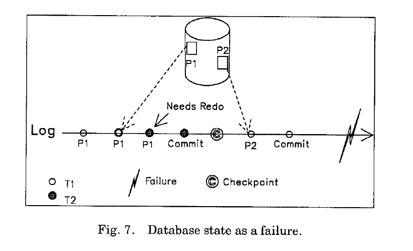
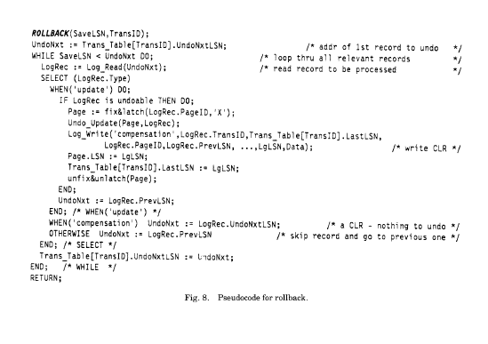

**5.NORMAL PROCESSIONG 正常处理**  
本章节讨论了在正常事务流程是如何执行的，第六章讨论了在系统恢复是如何处理的。  
**5.1Updates 更新**  
在正常处理时，事务可能处于，前进处理(forward processing),部分回滚，完全回滚。回滚可能是由系统或者应用启动的。导致回滚的原因可能是死锁，错误，完整性约束，非正常的数据库状态等等。  
如果锁的颗粒度是记录级的，那么当对一个页上的记录进行更新时，这个页会被钉在缓存中，并加上X闩，接着执行更新操作，追加一条日志，该日志的LSN会记录到该页的page_LSN字段（同时记录到事务表中），最后该页会被解锁并解除锁定。在写日志的时候页是一直锁定的。这么做是为了保证对于该页的日志顺序和该页的更新顺序是一致的。这么做是很重要的，一些redo信息是物理记录的（比如，某页的空闲空间），当历史重演的时候，需要保证物理redo可以正确的执行。在读取和更新页内容的时候，页也必需一直被锁住。这也是必需的，因为在对页进行垃圾回收的时候，可能会移动记录的位置。当这种垃圾回收机制运行的时候，其他事务不可以操作该页，所以，它们(事务)的访问可能会被拒绝。读取页加S闩，修改页加X闩。  
对索引操作时，无需对数据页加锁。一个页上最多可同时加两个页闩（参见【57,62】）。这意味着两个事务T1，T2可以以(T1,T2)的顺序来修改某页的不同部分，然后在以另一种顺序(T2,T1)的顺序来修改某索引页。这种场景在System R和SQL/DS系统中是无法实现的，这些系统使用锁而不是闩来保证物理一致性。典型的不同是：所有的（物理）页锁都是在RSS（数据管理）调用的最后才会被释放。一个RSS调用处理数据修改和相关的索引修改。这可能会触发很多IO等待和锁等待。这意味着死锁发生在单独（物理）页锁或者（物理）页锁和（逻辑）记录/key锁之间是有可能的。这对于System R和SQL/DS是一个大问题。  
  

图7描述了一种场景：当两个事务在提交的时候，系统崩溃了。The dotted lines show how up to date the states of pages PI and P2 are on nonvolatile storage with respect to logged updates of those pages.在重启恢复时，必须意识到，P1最近的一次写的日志记录（事务之后提交后）需要被redo，对于P2来说不需要redo。这种场景表明了使用LSN关联物理存储中的页状态和日志中的特定位置的必要性，同样，在checkpoint中需要记录一些信息来标识重启redo应该从何处开始(参见5.4节)。对于样例中的情景，重启时redo日志扫描至少要从T2的P1的最近一次更新日志开始，因为这些更新需要被redo。  
这并不是假定一条单独的日志记录就可以提供所有关于此更新操作的redo和undo所需的信息。有时候，可能需要写好几条记录。比如，一条记录用来记录undo信息，另一条用来记录redo信息。在这种情况下：
(1)undo-only日志需要写在redo-only日志前面。
(2)redo-only日志记录中的LSN应该记录在该页的page_LSN中。
第一条件使我们可以确保不会出现在系统奔溃时只有redo-only日志而没有undo-only日志的情况。继而，当重启恢复时，对redo-only日志redo之后（历史重演），然后发现没有undo-only记录来undo刚才的操作。考虑到undo-only记录是写在redo-only记录之前，第二种情况确保不会出现一种情况：因为页中包含了undo-only记录的LSN，而不是redo-only记录的LSN。物理存储中已经包含了该条redo-only记录的更新，重启恢复的时候就会做不必要的redo操作。这种不必要的redo可能会导致日志操作的完整性问题。  
在正常执行时，一些日志记录可能不能也没必要undo(准备，空闲空间大小更新等等)。这些我们称之为redo-only日志记录。参见10.3小节，有关于空闲空间更新情景的讨论。  
有时候，在(数据)记录校验之前，可能并不知道这个（数据）记录的标识。比如，在插入的时候，直到检查页后找到一个空闲位置时才能确定记录ID。在这种情况下，在闩上页后，必须获取记录锁。为了避免在获取闩后等待锁（可能会导致死锁），对于锁的获取是有条件，如果没有获取到，闩就会释放，然后无条件的获取锁。一旦无条件获取锁成功后，对页再次获取闩，然后之前的检验条件会再检测一遍。再次校验是有必要的，因为在页释放闩的时候，条件可能就发生改变了。可以在释放闩的时候记下page_LSN在重新闩上的时候，就可以快速校验是否有变化了。如果检测条件之后发现，仍然可以支持更新，接下来就会像之前说的执行。否则，就会执行相应的动作。如果条件锁能被直接获取，那么更新就会像之前那样执行。  
如果锁的颗粒度是页级别或者比页还要粗，那么就没必要对页加闩，因为锁页已经可以对事务执行进行隔离了。除了这个之外，其他动作和记录锁的动作一样。但是，如果，系统支持解锁，或者脏读，就算有页锁，事务在更新某页是仍然需要获取X闩，这样在读取该页的时候获取S闩就能保证物理一致性。镜像拷贝工具可能使用解锁读，来使得对真正运行的事务干扰减少到最小。  
ARIES的适用性并不仅仅局限于那些在使用锁来保证并发控制的系统中。一些其他的并发控制模型（类似锁）比如【2】中提到的，同样可以使用ARIES.  
**5.2 Total or Partial Rollbacks完全回滚或者部分回滚**  
为了可以灵活限制事务回滚的范围，提出了savepoint的概念【1,31】。在事务执行的任意时刻都可以建立savepoint.在同一时刻可以建立任意个数的savepoint.典型的例如DB2系统，每个SQL数据操作命令前都会建立一个savepoint。这是为了保证SQL层的原子性。在执行了一段时间之后，事务和系统会请求回滚某个savepoint之后的所有更新操作。在这种部分回滚之后，事务可以继续执行(参见图3)。如果回滚到一个savepoint或者更前的一个，这个savepoint将不再outstanding.当建立了一个savepoint，该事务写的最后一条日志记录的LSN就被称为SaveLSN,记录在虚拟存储中。如果，savepoint是在事务开始的时候建立的（比如，当还没有写日志记录的时候），SaveLSN就是0.当事务想回滚到某一savepoint，它会提供SaveLSN。如果savepoint是暴露给用户层，那么系统不应该直接将SaveLSN暴露给用户，而是使用一些替代值或者序列数字，来和内部的LSN做映射，IMS【42】和INGRES【18】就是这么做的。  
  
图8描述了ROLLBACK例程如何回滚到某个savepoint的。该例程的输入是SaveLSN和TransID。在回滚时,尽管在对页undo时需要获取闩，但不需要获取锁。由于，我们确保闩不会引起死锁，回滚事务就不会触发死锁，比如：System R 和R*【31，64】和【100】中的算法。在回滚时，日志记录按时间逆序进行undo，对于每个undo的记录，都会写一条CLR。为了描述的方便，我们假设undo操作的所有信息都会记录在一条CLR中。ARIES很容易扩展到写多个CLR的情况。这是有可能的，当执行一条逻辑undo的时候，有时会写一些non-CLR，比如【59,62】中描述的。正如之前提到的，当写CLR的时候，UndoNxtLSN字段会包含日志记录（触发写CLR的日志记录）的PrevLSN。由于CLR永远都不会被undo,它们不需要包含undo信息（比如：before-images）。redo-only日志记录在回滚时会被忽略。当遇到non-CLR时，处理完之后，通过查找它的PrevLSN值来确定下一条要处理的记录。当回滚的时候遇到CLR，通过该记录的UndoNxtLSN值来确定下一条待处理的日志记录。因此，UndoNxtLSN指针帮我们跳过那些已经undone的日志记录。这就意味着，如果发生了嵌套回滚，那么，由于CLR中的UndoNxtLSN在第二次回滚的时候就不会再次指向第一次回滚已经执行过的日志了。尽管图4，5,13描述了在不同恢复方法中，如何结合重新undo来实现部分回退，显而易见，AIRES提供的嵌套回滚更有效率。  
通过CLR来描述在undo过程中执行的动作，使得我们可以不需要强制按照原来操作的逆向顺序进行操作。尤其，这个undo操作影响的页并不在原始的操作涉及到。这种逻辑undo情况，是有可能的比如，索引管理【62】和空间管理（参见10.3小节）  
ARIES在undo时对日志记录的有限性保证使得我们可以在小型系统中安全使用，在这种情况下，可能会使用在线循环日志并且log space is at a premium.知晓了这个范围，在一些极端情况下（比如日志空间短缺），我们就可以预留足够的日志空间来使得所有正在运行的事务都能回滚。0S/2 Extended Edition Database Manager实现的ARIES就利用了这一特性。  
当事务回滚时，在构建savepoint（回滚时会以此为目标）之后获取的锁，会在部分回滚或者全部回滚完成后释放掉。

