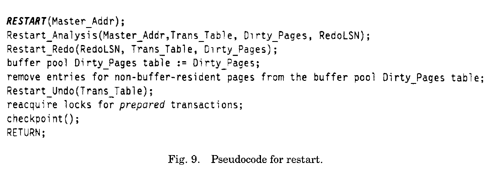
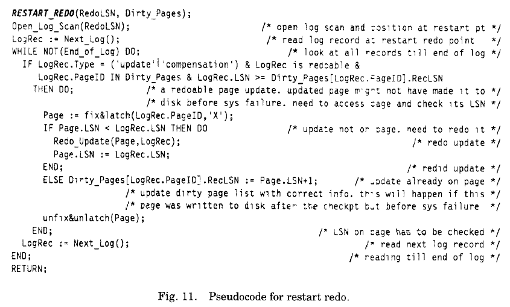
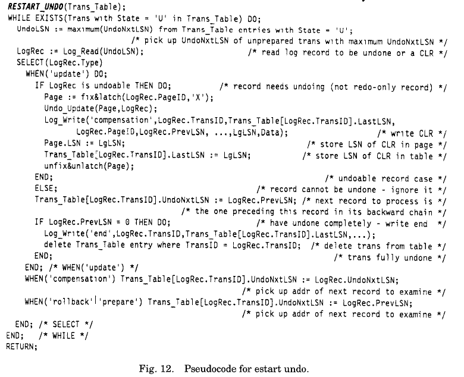
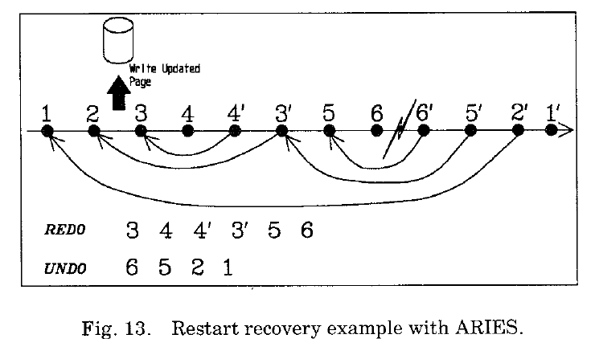

**6.RESTART PROCESSIONG重启流程**  
当事务型系统崩溃后重启，恢复策略需要保证数据的一致性和事务的原子性和持久性。图9描述了在系统重启恢复时起始调用的RESTART例程。该例程的的输入是master record的LSN,它包含了系统奔溃前的最后一次完整checkpoint的begin_chkpt记录的指针。该例程顺序触发分析遍历，redo遍历和undo遍历。缓存池的脏页表也会恰当的进行更新。在恢复结束后，会执行一次checkpoint.  
考虑到高可用性，重启流程的耗时必须尽可能的短。达到此目标的一种方法就是并行进行redo遍历和undo遍历。只有当使用并发遍历的时候，才需要在修改页数据的时候加闩。最理想的情况就是在重启恢复过程中，仍然允许执行新事务，参见[60]。 
  
**6.1Analysis Pass 分析遍历**  
重启恢复流程中第一次遍历就analysis pass。图10描述RESTART_ANALYSIS例程是如何执行这些遍历动作的。该例程的输入是master记录的LSN。输出是一个包含处于in-doubt或unprepared态的事务列表，一个包含可能是脏页的列表，和RedoLSN（标识redo遍历需要从哪边开始处理日志）。该例程唯一会写的日志记录就是事务的end记录（在系统崩溃前事务已经完全回滚，但是丢失了end记录）。  
在遍历过程中，如果一条日志记录所对应的页并不在脏页表中，那么就会在表中生成一个实例并用当前记录的LSN作为其也的RecLSN。同时通过修改事务表跟踪这些事务的状态变更，并且记录最近一次日志的LSN以便在确定这个事务需要回滚的后做undo。如果遇到OSfile_return日志记录，该文件中的页如果在脏页表中，那么就会被移除，以确保在redo遍历的时候不会访问到该文件的这个版本的页。一旦导致文件删除的原始操作提交了，相同的文件会在随后被重写创建和更新。在这种情况下，重建的文件中的页会出现在脏页表中，它们的RecLSN值会比文件删除时的日志结尾的LSN要大。在分析遍历结束后，RedoLSN为脏页表中的最小的RecLSN值。如果脏页表为空，那么就可以跳过redo遍历。  
其实并不需要独立做一次分析遍历，在0S/2 Extended Edition Database Manager实现的ARIES中就没有分析遍历。这很特殊，因为正如我们之前提到的（参见6.2节），在redo遍历时，ARIES无条件的redo所有丢失的更新。也就是说，不管他们的记录的是失败的还是没有失败的事务，都会redo，这一点和System R,SQL/DS,DB2不同。因此，redo并不需要知道事务是否失败。这个信息严格的来说对undo遍历有用。对于某些系统可能并不适用（比如DB2），它在in-doubt态的事务获取的锁，来自于进行redo遍历时从in-doubt事务日志记录中的锁。这种获取锁的方式使得对RedoLSN的计算就要考虑到in-doubt态的事务的Begin_LSN，继而我们就得在redo遍历之前知道各个in-doubt事务的标识。  
除了分析遍历外，事务表可以通过checkpoit记录和redo遍历时遇到的日志记录来构建。RedoLSN就是min(min(end_chkpt记录中的脏页表的RecLSN),LSN(begin_chkpt记录))。不使用分析遍历，就需要使用其他方法来避免更新那些已经归还给操作系统的文件。另一个结论是，在redo遍历中的脏页表不能用来过滤begin_chkpt记录之后的操作日志记录。  
**6.2 Redo遍历**  
在重启恢复的第二道遍历是redo遍历。图11描述了RESTART_REDO例程是如何实现遍历的。这个例程的输入是RedoLSN和restart_分析例程提供的脏页表。该例程不会输出任何日志记录。redo遍历从RedoLSN开始扫描日志记录。如果遇到一个可redo的日志，会检测该页是否在脏页表中。如果在，并且该记录的LSN大于等于脏页表中该页的RecLSN，那么该条日志就可能需要redo.为了进一步确认，会访问该页，如果该页的LSN小于记录的LSN,那么就需要更新该日志。这样，RecLSN信息就限制了需要检查的页的数量。该例程重建了系统崩溃时刻的数据库状态。甚至那些丢失的事务的更新也被redo了。在历史重演背后的基本原理会在10.1节详细解释。这就意味着，有些丢失的事务的redo日志是不需要的。在【69】中，我们会讨论一种限制历史重演的方案，从而可能减少在本次遍历中被认为是脏页的数量。  
  
由于redo是面向页的，在redo遍历的时候只有在脏页表中的页才可能被修改。只有脏页表中的页才会被读取和校验。不是所有读取的页都需要redo。这是因为有些页在最后一次checkpoint的时候是在脏页表中的，但是在系统崩溃前这些脏页已经刷到非易失存储上了。因为某些原因，比如减少日志大小，降低CPU负载，并不能期望系统会写日志标识已经刷到非易失存储上的脏页。尽管，这样做是可以的，并且这种日志记录可能减少在分析遍历的时候碰到在脏页表中的记录数。尽管，这些记录是在IO完成之后才会写，系统崩溃是在很短时间内发生，可能这些记录就没写出来。那么相应的页在本次遍历的时候就不会发生变更。  
为了简单起见，对于系统崩溃在事务完成日志记录和在执行该事务的追加动作之间，我们不会讨论在redo遍历时如何redo这些残留的追加动作。  
为了利用并行模型，脏页表中的信息可以使用异步IO来读取这些页，这样当redo遍历的时候遇到这些记录时，它们已经在缓存中了。Since updates performed during the redo pass are not logged, we can also perform sophisticated things like building in-memory queues of log records which potentially need to be reapplied (as dictated by the information in the dirty .pages table) on a per page or group of pages basis and, as the asynchronously initiated 1/0s complete and pages come into the buffer pool, processing the corresponding log record queues using multiple processes。这就要求每个队列只能由一个进程操作。对不同页的更新顺序可能和日志中记录的顺序不一样。这并不会丢失正确性，因为对于给定的页，所有丢失的更新都会与之前一致的顺序进行操作。这些并行的思想对于通过远程备份来进行灾难恢复同样适用。  
**6.3 Undo遍历**  
在重启恢复第三道遍历是undo遍历。图12描述了RESTART_UNDO例程是如何实现这些操作的。该例程的输入是重启的事务表。undo遍历不会参考脏页表。并且，由于在undo遍历初始化时，已经进行历史重演了，所以并不会参考页中的LSN来决定一个undo操作是否需要做。对比我们将会在10.1小节讨论的DB2系统，它并不会重演历史，但是会执行selective redo.  
  
restart_undo例程在一个日志中以逆序的方式回滚了丢失了的事务。对于仍未完成undo的事务，连续获取其下一条待处理记录的最大LSN,直到没有丢失的事务需要处理。下一条待回滚处理的记录是由事务表决定的。处理日志记录的方式和之前在5.2节描述的一样。在回滚过程中，会写CRL。在遍历过程中，将脏页刷出到非易失存储上是，缓存管理模块遵循WAL协议。 
利用并行性，可以用多进程来处理undo遍历。需要注意的是，由于CLR的UndoNxtLSN链，每个事务只能由一个进程完整处理。仍然有可能的是，先写了CLR，但没有对这些页进行undo(参加6.4节讨论了需要逻辑undo时遇到的问题)，然后如6.2节一样并行redo CLR。在这种模型下，实际对页的变更的undo操作可以并行执行，甚至在同一事务中也可以。  
  
图13描述一种使用ARIES进行重启恢复的场景。在这里，多条日志记录更新了同一页。在系统崩溃前，在第二次更新时，数据页被刷到了磁盘上。在写完磁盘后，执行了一个部分回退（对记录4,3的undo）,接着事务继续执行(更新了5,6)。在重启恢复时，丢失的更新（3,4,4',3',5,6）会先redo，然后执行undo（6,5,2,1）。每一条日志记录会至少匹配一条CLR,不管执行多少次重启恢复。  
使用ARIES，我们可以在重启恢复后继续已失败的事务。由于，ARIES重演了历史，并且支持savepoint，我们也可以在undo遍历的时候回滚这些失败的事务到最后一次savepoint,而不是全部回滚。接着，我们可以在某个特殊点触发其应用，并传入关于savepoint的信息来重启事务。想要正确的执行这些需要：(1)能够从事务未提交的日志记录（不是undo更新）中获取锁信息。(2)在完成恢复之前持有这些锁。(3)记录足够多的关于savepoint的信息，这样系统就能恢复游标位置，程序状态等等。  
**6.4 Selective or Deferred Restart选择性或延迟重启**  
有时候，当系统崩溃后，我们希望尽可能快的重启一个新事物。因此，我们希望能将恢复工作推迟到以后再做。当一些重要数据不可用时，通常也会这么做来节省时间。首先先恢复这些数据，然后开放系统来开启新事务。比如在DB2中，甚至允许在系统启动好之后，可以对一些离线的数据使用redo,undo来恢复。如果一些undo工作需要对离线数据上的丢失的事务来执行，那么DB2就会单独写CLR，并且结束该事务。这是有可能的，因为在事务正常执行时【15】CLR可以基于non-CLR记录单独生成。由于页(或者索引中的迷你页)，是锁的最小颗粒，undo操作是以原始操作的逆序执行的。也就是说DB2中没有逻辑undo.DB2在一个异常表（通常叫做数据库分配（DBA）表，保存在日志或者虚拟存储中）,记录在系统上线后，仍然待恢复的离线数据，在恢复之前它们不能被其他事务访问【14】。这些日志记录的LSN范围同样会记录下来。除非有一些处于in-doubt态的事务在这些数据上有未提交的更新，那么在恢复完成之前，这些数据都不允许访问，也就不需要加锁了。当这些数据上线使用时，恢复机制会使用之前记录的日志记录范围来继续恢复。甚至在正常回滚时，对于这些离线数据也要写CLR  
In ARIES also, we can take similar actions, provided none of the loser transactions has modified one or more of the offline objects that may require logical undos.这是因为逻辑undo需要数据的当前状态。Redo是没有问题的，因为它们是面向页的。对于逻辑undo会触发空间管理（参见10.3节），通常，我们采取一种保守方案，并且生成合适CLR。比如，在插入操作的undo时，会写一条关于空间相关（当前页是0%满的）的CLR。但是对于高并发的场景，由于逻辑undo（比如，遍历索引树来删除key）的影响，以及对页的影响是难以预料的，因此【62】的索引管理方式就不可用了。实际上，我们甚至无法预测 面向页的undo何时不可用，因此逻辑undo是不需要的。 
如果两个记录集合是interspersed,在恢复的时候是无法处理事务中一些记录的undo的，也无法处理在那一时刻之后的undo(可能，逻辑的)。记住，在所有的恢复方法中，事务的undo是以一种逆序的方式执行的。所以，在undo的时候记住每个事务的下一条待处理的记录就足够了，根据这条记录，PrevLSN和UndoNxtLSN链引导我们处理剩下的记录。  
即使在一些场景下，一个或多个失效事务必须得在一些离线数据上执行undo（可能是逻辑的），如果得支持延迟重启，我们建议以下的算法：  
- （1）对在线数据进行历史重演，推迟对离线数据处理，并记录其日志范围。  
- （2）像之前一样处理undo遍历，如果某个失效事务的一个记录无法生成CLR，那么就停止这个事务的undo。这种事务被成为停止事务。但是会继续执行其它未停止的事务。  
- （3）对于停止事务，需要获取锁来保护那些还没undo的更新。这可以作为undo遍历的一部分，就和平常一样，通过连续跟踪指针来完成。并且根据停止事务写的non-CLR来获取锁。  
- （4）当恢复完成时，之前的离线数据变成在线数据，首先基于之前记录的日志范围进行历史重演，然后继续那些停止事务的undo。当所有的停止事务都完全回滚后，释放他们持有的锁。  
- （5）当某个离线数据变成在线，对于该数据的历史重演已完成，那么新事务就可以并发访问该数据对象，更进一步的，那些停止事务就可以继续执行。  
上面所说的要求能够从更新(non-CLR)日志记录中获取锁信息。DB2在in-doubt事务中就这么做了。 
尽管待恢复的数据对象没有离线的，但是如果在失效事务全部回滚之前，如果想开启新事务，那么我们需要遵循以下几条：  
（1）首先基于其日志记录，重演历史并且对那些失效的in-doubt事物中未提交的更新加锁。  
（2）

